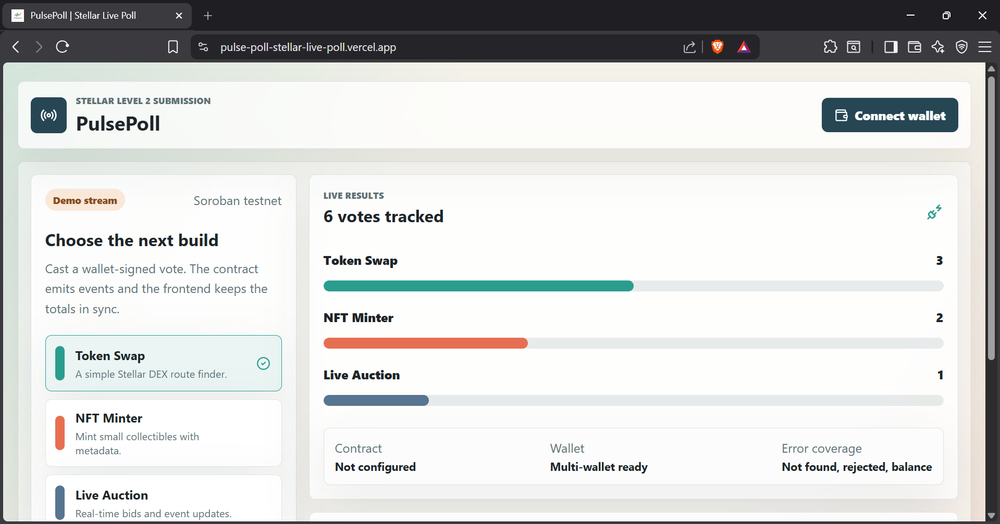

# PulsePoll - Stellar Level 2 Live Poll

PulsePoll is a multi-wallet Stellar testnet dapp with a Soroban smart contract, wallet-signed voting, transaction status tracking, and live event synchronization.

## What It Demonstrates

- Multi-wallet support through `@creit.tech/stellar-wallets-kit`
- Error handling for wallet not found, user rejection, insufficient balance, network errors, and unknown failures
- Soroban contract with `vote` and `results` functions
- Frontend contract writes and reads
- Pending, success, and failed transaction states
- Realtime contract event polling with automatic result refresh
- Demo stream mode so the UI can be reviewed before deployment

## Tech Stack

- Vite + React + TypeScript
- Stellar Wallets Kit
- Stellar SDK Soroban RPC
- Soroban Rust smart contract

## App Idea

Users vote on which Stellar project should be built next:

- Token Swap Interface
- NFT Minter
- Live Auction

Each vote calls the Soroban contract, updates on-chain totals, emits a `vote` event, and refreshes the UI from live testnet state.

---

## Submission Evidence

- **Public GitHub repository:** https://github.com/tripy-mehta/PulsePoll-Stellar-Live-Poll
- **Live demo link:** https://pulse-poll-stellar-live-poll.vercel.app/
- **Deployed contract address:** `CAT4BOL7HQQ7C37C7H3UEPBNSMPTVD65XBTKWOXGHG76YDL3RHVCI56M`
- **Transaction hash of contract call:** `90d8f14cc1c0b018bbbd272c9abd9bce109d5819cffc52c4260820470986e487`

### Site Demonstration

**Dashboard:**  


**Wallet Options:**  


**Connected and Balance:**  


**Successfully Voted:**  


**Event Feed Sync:**  


**Hash Verified:**  


---

## Setup

```bash
npm install
cp .env.example .env.local
npm run dev
```

Open the local URL printed by Vite.

By default `VITE_DEMO_MODE=true`, which lets reviewers see the live feed and transaction UI without a deployed contract. Set `VITE_DEMO_MODE=false` after deploying.

## Deploy Contract To Stellar Testnet

Install the Stellar CLI:

```bash
cargo install --locked stellar-cli
rustup target add wasm32-unknown-unknown
```

Fund a testnet account at the Stellar Laboratory or Friendbot. Then fill these in `.env.local`:

```bash
DEPLOYER_SECRET_KEY=SA...
DEPLOYER_PUBLIC_KEY=G...
```

Build and deploy:

```bash
npm run contract:build
npm run contract:deploy
```

Copy the returned contract ID into `.env.local`:

```bash
VITE_CONTRACT_ID=C...
PUBLIC_POLL_CONTRACT_ID=C...
VITE_DEMO_MODE=false
```

Restart the frontend:

```bash
npm run dev
```

## Verify A Contract Call

Use the frontend vote button with Freighter, xBull, LOBSTR, Hana, or another Stellar Wallets Kit-compatible wallet.

You can also invoke from the CLI:

```bash
npm run contract:invoke -- dex
```

Record the resulting transaction hash and verify it on Stellar Expert testnet.

## Project Structure

```text
contracts/live-poll/     Soroban smart contract
scripts/                 Deployment and invoke helpers
src/lib/                 Wallet, Stellar RPC, errors, formatting
src/main.tsx             Main dapp UI
src/styles.css           Responsive interface styling
```

## Notes For Reviewers

The app starts in demo mode because secret keys and funded testnet accounts should not be committed. Once `VITE_CONTRACT_ID` is set and `VITE_DEMO_MODE=false`, the same UI path submits signed wallet transactions to the deployed Soroban contract and polls emitted events from testnet.
